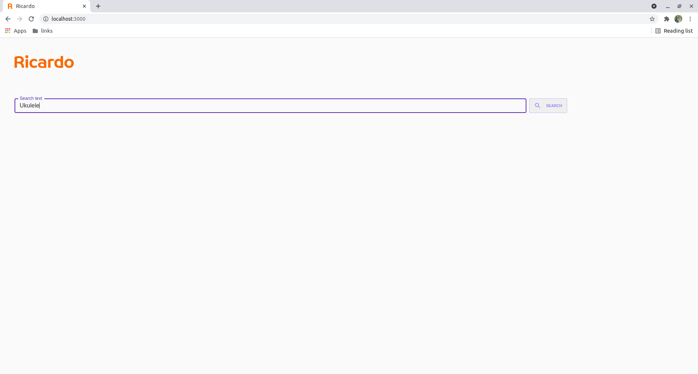
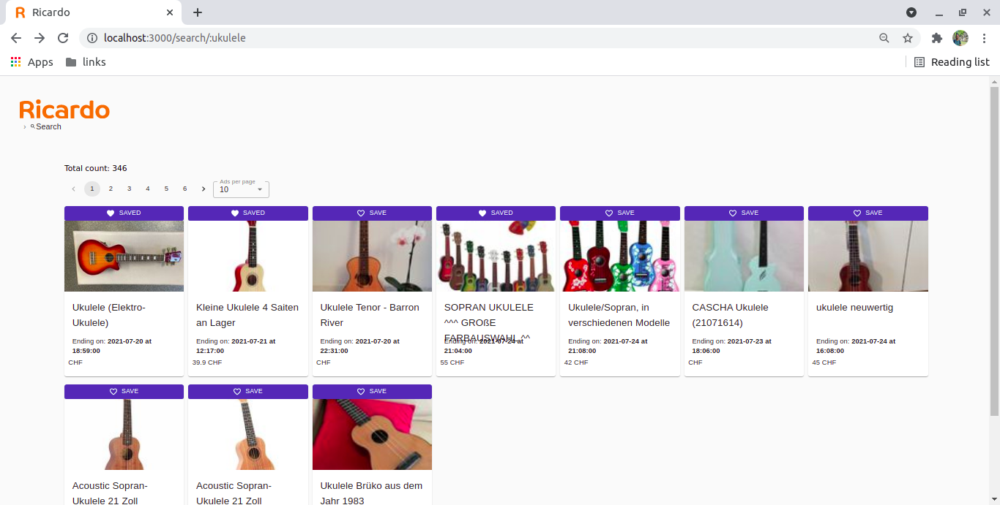
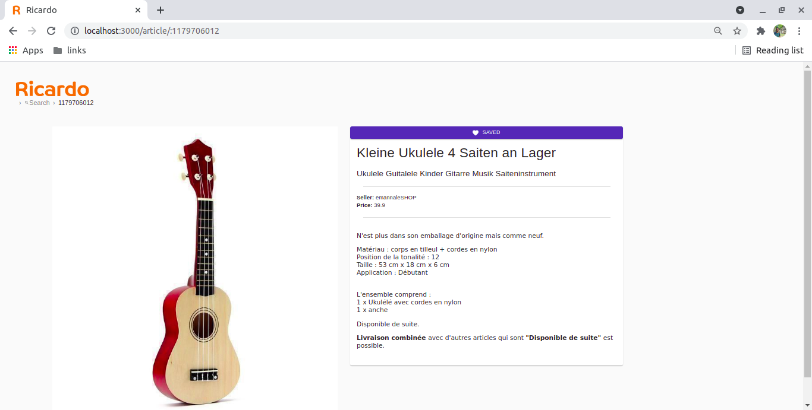

# Ricardo React exercise

## Description

The goal of this exercise is to build a (very) **small version of Ricardo** using Ricardo's api.
The application is described below

* The typescript branch is experimental, and includes additional features such as pagination and breadcrumbs but types logic is not perfect.

* The withFavorite branch is an extentio of typescript branch, and on top of it, it includes a small addition, a favorite posibility that is stored in the local storage of the user's broweser.
### Home Page

- Users first land on the **Home Page** where they would see a search bar and a (initially disabled) `SEARCH` button
- `SEARCH` button is **disabled by default**. Typing anything on this search bar enables the `SEARCH` button.
- Clicking the `SEARCH` button goes to the **Search page**

- given example:
  

- result:
  

### Search Page

- The **Search page** shows the **total number** of results
- The **Search page** shows a list of article cards **from Ricardo's inventory** where each card contains:
  - A picture
  - The title of the article
  - The end date of the article
  - The price in CHF
- Clicking on a product card (you can also add a link inside the product card if you prefer) navigates to the **Product Details Page**
- Clicking the Ricardo logo navigates back to the **Home Page**
- given example:
  

- result:
  

### Product Details Page

- The **Product Details Page** shows a bit more details about the product:
  - The image (big size)
  - The title
  - The subtitle (if any)
  - The seller name
  - The price
  - The description (formatted in HTML)
- Clicking the Ricardo logo navigates back to the **Home Page**

- given example:
  

- result:
  

## to Run the project please follow the next steps:

1. pull the project from the repo

- to have successful fetches please add **.env** file on root level and create a variable with the name **REACT_APP_RICARDO_RECRUITMENT_API_TOKEN** with your secret API token.

2. In the project directory, run yarn install and then yarn start

Runs the app in the development mode.\
Open [http://localhost:3000](http://localhost:3000) to view it in the browser.

Project structure and brief explanation:

- by principle, only a component folder name start with a capital letter.
- global styles can be found in the **src/styles** otherwise each component style file is located in the same folder as the component itself at the same level as its index.tsx file

```bash
"
Ricardo
├── node_modules
├── public
│   ├── favicon.ico
│   ├── index.html
│   ├── logo192.png
│   ├── logo512.png
│   ├── manifest.json
│   └── robots.txt
│
├── src
│   ├── __tests__                   --> tests folder
│   │   └── home.test.tsx           --> contains 2 tests for the home page requiremets
│   │
│   ├── asstes
│   │   └── logo.svg
│   │
│   ├── components
│   │   ├── ArticleCard
│   │   │   ├── ProductDetailsCard  --> card for the product details page
│   │   │   │   ├── index.tsx
│   │   │   │   └── style.ts
│   │   │   │
│   │   │   ├── SearchResultsCard   --> card for the search results page
│   │   │   │   ├── index.tsx
│   │   │   │   └── style.ts
│   │   │   │
│   │   │   └── index.tsx           --> import ArticleCard with an attribute type='productDetailsCard' / type='searchResultsCard'
│   │   │
│   │   ├── Button
│   │   │   ├── AddToFavButton      --> button for both types of articleCard
│   │   │   │   └── index.tsx
│   │   │   │
│   │   │   ├── SearchButton        --> button for startpage
│   │   │   │   ├── index.tsx
│   │   │   │   └── style.ts
│   │   │   │
│   │   │   └── index.tsx           --> import Button with an attribute type='searchButton' / type='addToFavButton'
│   │   │
│   │   ├── Input                   --> search input field
│   │   │   ├── index.tsx
│   │   │   └── style.ts
│   │   │
│   │   ├── Layout                  --> for all layouts, currently only has one file
│   │   │   └── container.tsx       --> basic responsiveness, add attribute padding='true' for extra padding
│   │   │
│   │   ├── Logo                    --> the logo wrapped with Link to home page
│   │   │   └── index.tsx
│   │   │
│   │   ├── SearchResultsPagination --> search page pagination component
│   │   │   ├── index.tsx
│   │   │   └── style.ts
│   │   │
│   │   └── Spinner                 --> spinner to show until data is loaded
│   │       ├── index.tsx
│   │       └── style.ts
│   │
│   ├── helpers                     --> folder for global functions
│   │   ├── constants.js            --> contains action types for the store's reducer, the base url and the apiToken variable
│   │   └── fetches.js              --> the different needed fetch functions for the app
│   │
│   ├── pages                       --> the project pages, currently only 3
│   │   ├── home.tsx
│   │   ├── productDetails.tsx
│   │   └── searchPage.tsx
│   │
│   ├── routes                      --> the basic structure and all routes
│   │   └── index.tsx
│   │
│   ├── store                       --> project's store, actions and reducer, currently based on the context API
│   │   ├── actions.js
│   │   ├── index.tsx
│   │   └── reducer.js
│   │
│   ├── styles                      --> golbal styles and theme
│   │   ├── index.js
│   │   └── wrappers.js
│   │
│   ├── index.js                    --> main index.tsx file
│   └── setupTests.js
│
├── .gitignore
├── .env                            --> **add your personal apiToken here**
├── README.md
├── package.json
└── yarn.lock
"
```
